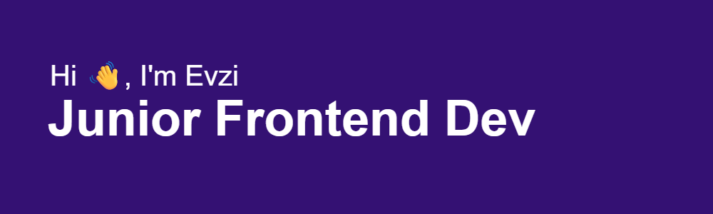

# 💫 About Me:
🔥  I work as Solution expert for The Norwegian Armed Forces (SAP BW4/HANA) 🏫 I have one year IT at OsloMet - Done in 06/2025 

## Connect with me
  [My Favorite Scrimba Course]([https://scrimba.com/learn-javascript-c0v?via=u01b5bn](https://scrimba.com/frontend-path-c0j)

# 💻 Tech Stack:
## Frontend
          

## Backend
    

## Tools
   

# 📊 GitHub Stats:
 

## 🏆 GitHub Trophies

<!-- Proudly created with GPRM ( https://gprm.itsvg.in ) -->
